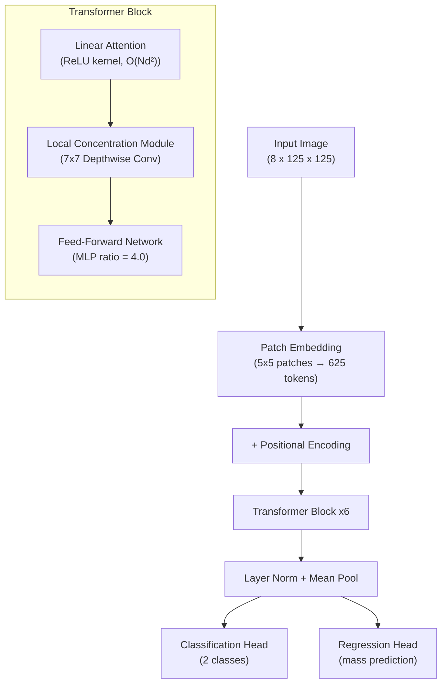
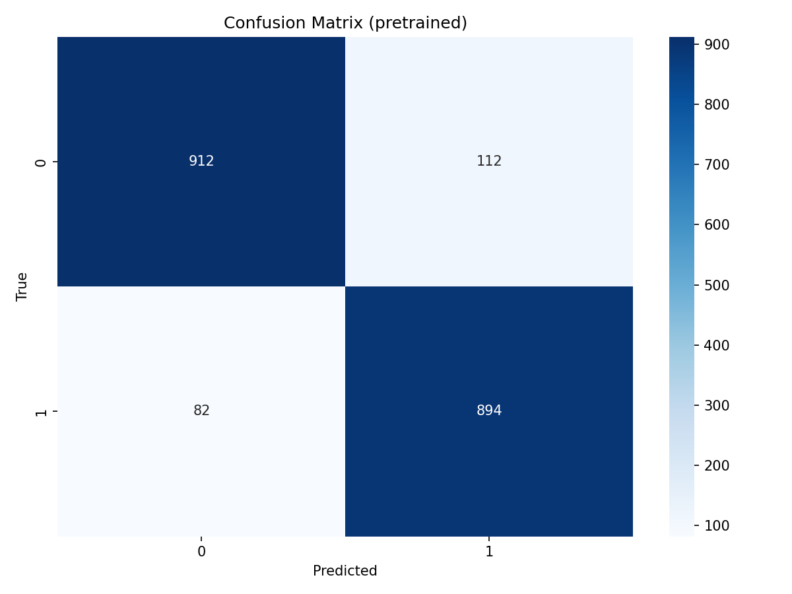
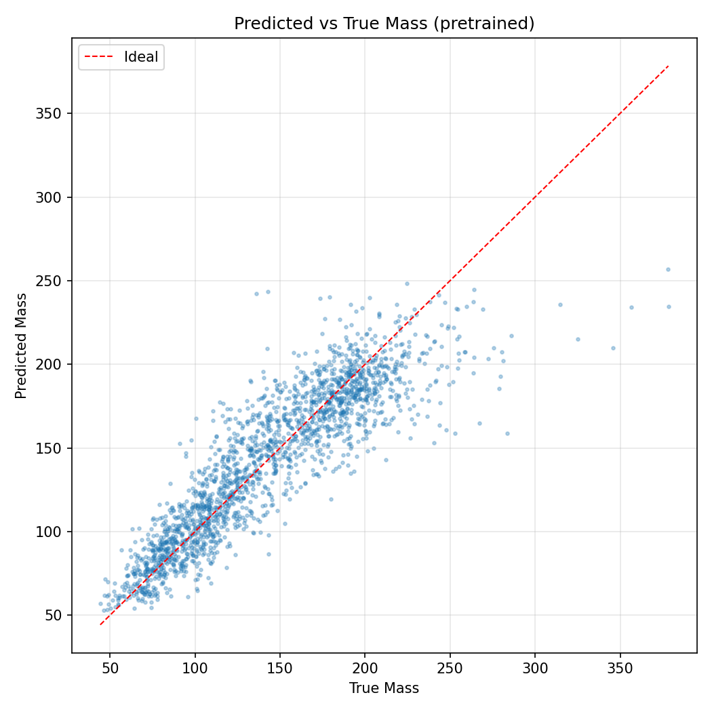
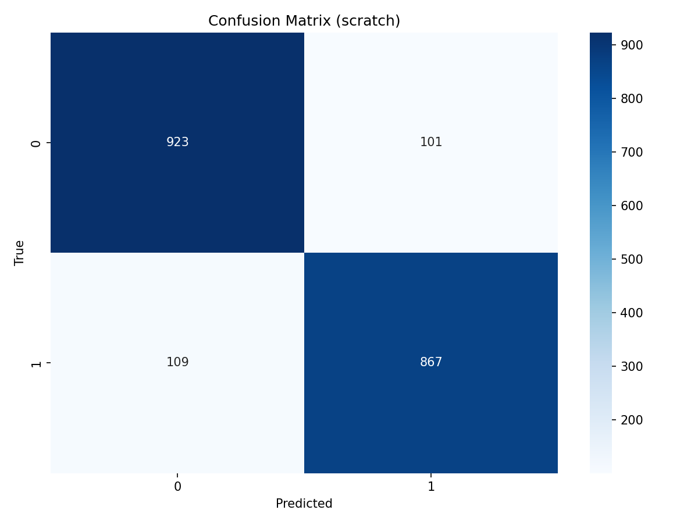
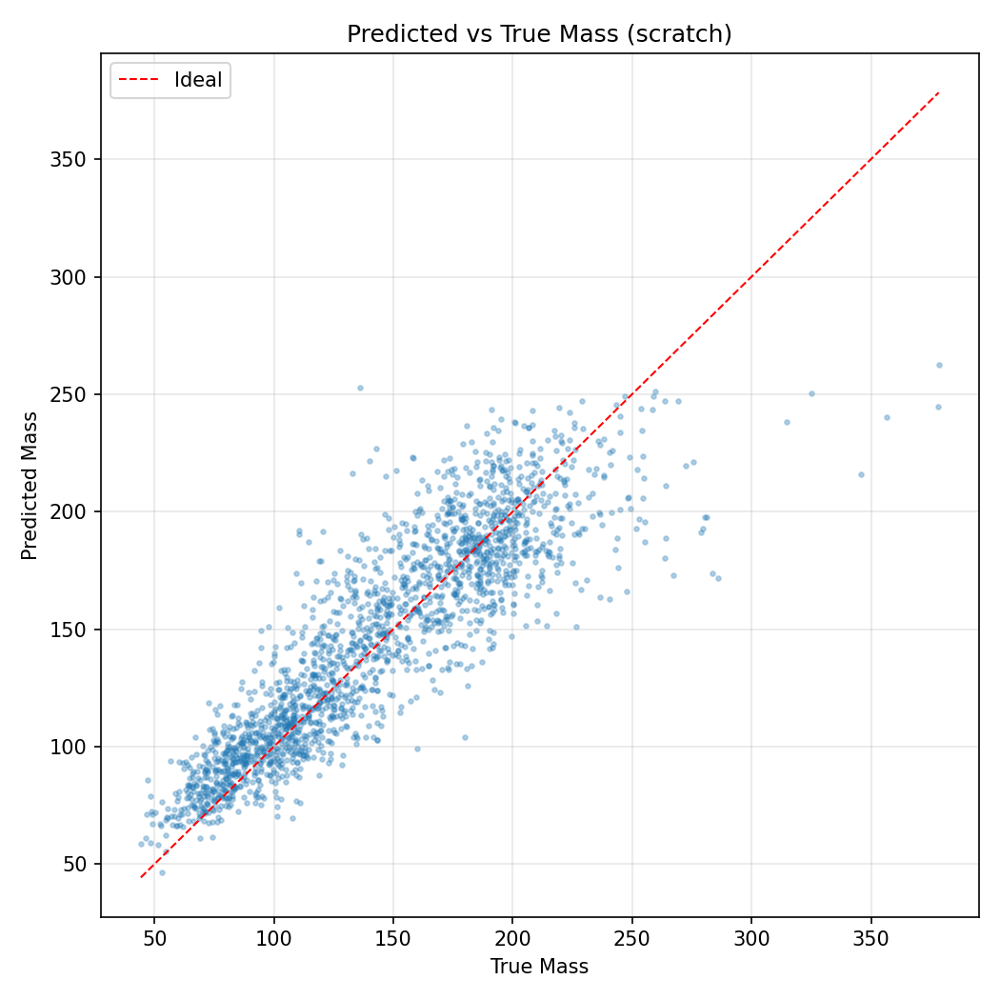
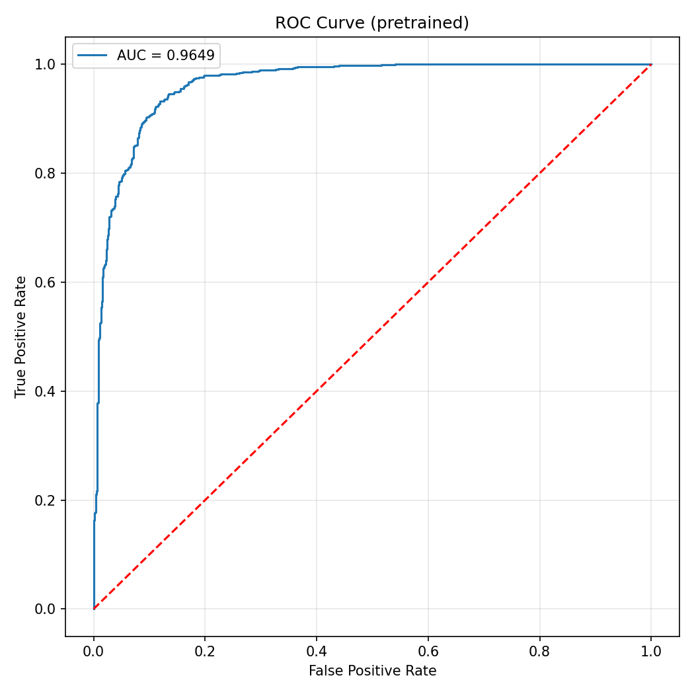
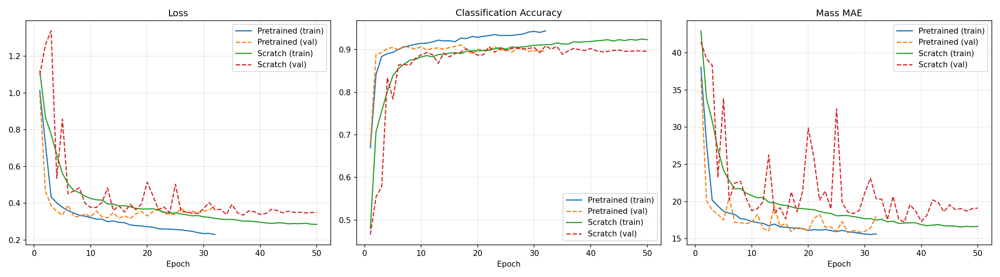
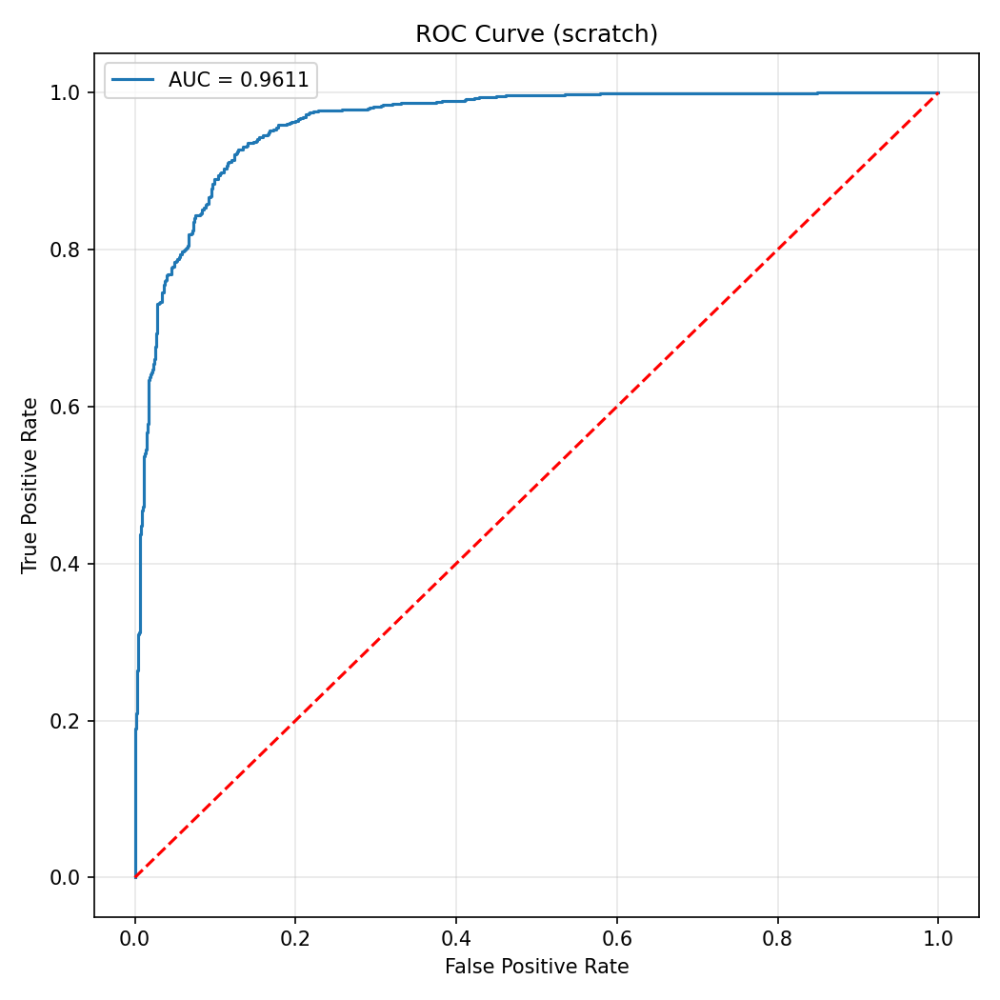

# Linear Attention Vision Transformer for End-to-End Mass Regression and Classification

> **ML4SCI GSoC 2026 — Specific Task 2h**
> CMS End-to-End Deep Learning Project

---

## Abstract

We present a linear-scale attention Vision Transformer (L2ViT) for simultaneous binary classification and mass regression on multi-channel CMS calorimeter images. The model uses ReLU kernel-based attention with $O(Nd^2)$ complexity and a Local Concentration Module (LCM) for local spatial reasoning. We explore two self-supervised pretraining strategies on the 28 GB unlabelled CMS dataset: Masked Autoencoder (MAE) reconstruction and SimCLR contrastive learning with physics-aware augmentations. We find that MAE pretraining degrades downstream performance due to the extreme sparsity of the data (98.8% zeros) and the architectural incompatibility between masking and LCM. SimCLR contrastive pretraining with detector-symmetry-preserving augmentations consistently improves all metrics over training from scratch.

**Links:** [ML4SCI Project Page](https://ml4sci.org/gsoc/2026/proposal_E2E5.html) | [Model Weights (GitHub Release)](https://github.com/YOUR_USERNAME/YOUR_REPO/releases/tag/v1.0)

---

## Table of Contents

- [Architecture](#architecture)
- [Self-Supervised Pretraining](#self-supervised-pretraining)
- [Results](#results)
- [Setup and Reproduction](#setup-and-reproduction)
- [Project Structure](#project-structure)
- [Discussion](#discussion)
- [References](#references)

---

## Architecture

The model follows the L2ViT architecture (Zheng et al., 2025), replacing quadratic softmax attention with a linear-scale alternative.



### Key Components

| Component | Specification |
|---|---|
| Input | 8 channels, 125 x 125 pixels |
| Patch Size | 5 x 5 (625 tokens) |
| Embedding Dimension | 256 |
| Transformer Depth | 6 blocks |
| Attention Heads | 4 (head_dim = 64) |
| Attention Type | ReLU kernel linear attention |
| LCM Kernel | 7 x 7 depthwise convolution |
| Output | Classification logits (2 classes) + mass scalar |

### Linear Attention

Standard softmax attention has $O(N^2 d)$ complexity. We use a ReLU kernel decomposition:

$$\text{Attn}(Q, K, V) = \frac{\phi(Q) \cdot (\phi(K)^T V)}{\phi(Q) \cdot (\phi(K)^T \mathbf{1})}$$

where $\phi(\cdot) = \text{ReLU}(\cdot)$. Computing $K^T V$ first yields a $d \times d$ matrix, reducing complexity to $O(Nd^2)$. A learnable per-head temperature parameter scales the attention output.

### Local Concentration Module (LCM)

Linear attention loses local spatial detail relative to softmax attention. The LCM compensates by applying a depth-wise convolution (7x7) within each transformer block, providing local neighborhood context within the residual stream.

---

## Self-Supervised Pretraining

We pretrain the backbone on the unlabelled CMS dataset (~57,000 images, 28 GB) before finetuning on the 10,000-sample labelled dataset.

### Strategy Comparison

We explored two pretraining strategies:

| | MAE (Masked Autoencoder) | SimCLR (Contrastive) |
|---|---|---|
| Objective | Reconstruct masked patches | Distinguish different collision events |
| LCM during pretraining | Skipped (masked tokens break spatial grid) | Fully active |
| Downstream Accuracy | 86.05% (worse than scratch) | **90.60%** (better than scratch) |
| Conclusion | Ineffective on sparse data | Effective |

MAE pretraining failed for two reasons: (1) with 98.8% zero pixels, the reconstruction loss is dominated by trivially predicting background, and (2) masking requires `skip_lcm=True`, leaving LCM weights randomly initialized during finetuning.

### SimCLR Configuration

| Parameter | Value |
|---|---|
| Loss | NT-Xent (InfoNCE) |
| Batch Size | 128 |
| Temperature | 0.5 |
| Projection Dim | 128 |
| Learning Rate | 3e-4 (cosine with 5-epoch warmup) |
| Weight Decay | 0.05 |
| Early Stopping | patience = 15 |

### Physics-Aware Augmentations

The CMS detector images are in $(\eta, \phi)$ space. Our augmentations respect the physical symmetries of the cylindrical CMS detector and proton-proton collisions:

| Augmentation | Implementation | Physics Justification |
|---|---|---|
| $\phi$-flip | `img.flip(-1)` | Azimuthal symmetry of the cylindrical detector |
| $\eta$-flip | `img.flip(-2)` | Forward-backward symmetry of pp collisions |
| Cyclic $\phi$-roll | `torch.roll(img, shift, dims=-1)` | $\phi$ is periodic (detector wraps in azimuth) |
| Channel dropout | Zero 1-2 of 8 channels | Partial detector readout robustness |
| Active-cell noise | Gaussian noise on non-zero pixels only | Electronic readout noise in active calorimeter cells |

We explicitly avoid augmentations that are inappropriate for calorimeter data: color jitter, random crops, Gaussian blur, and grayscale conversion.

---

## Results

### Finetuning Configuration

| Parameter | Pretrained | Scratch |
|---|---|---|
| Backbone LR | 5e-5 | 3e-4 |
| Head LR | 1e-4 | 3e-4 |
| Batch Size | 64 | 64 |
| Weight Decay | 0.01 | 0.01 |
| Warmup Epochs | 3 | 3 |
| Early Stopping | patience = 15 | patience = 15 |

Both models share the identical architecture and are evaluated on the same deterministic 20% test split (2,000 samples, `seed=42`).

### Quantitative Comparison

| Metric | Pretrained (SimCLR) | Scratch | Improvement |
|---|---|---|---|
| **Test Accuracy** | **90.60%** | 89.10% | +1.50% |
| **ROC-AUC** | **0.9656** | 0.9578 | +0.78% |
| **Mass MAE (GeV)** | **15.83** | 17.20 | -8.0% |
| **Mass MSE** | **489.7** | 549.6 | -10.9% |
| **Test Loss** | **0.318** | 0.372 | -14.6% |

The pretrained model outperforms scratch across all five metrics, demonstrating that self-supervised pretraining on the unlabelled data produces transferable representations for both classification and mass regression.

> **Note:** These are preliminary results. After applying physics-aware augmentation refinements (cyclic $\phi$-roll replacing 90-degree rotation) and an attention stability fix (`denom` floor 1e-6), results may change upon retraining.

### Evaluation Plots

| Confusion Matrices | Mass Regression |
|---|---|
|  |  |
|  |  |

| ROC Curves | Training Curves |
|---|---|
|  |  |
|  | |

---

## Setup and Reproduction

### Requirements

```bash
pip install -r requirements.txt
```

### 1. Download Data

```bash
python download_data.py                   # download both datasets
python download_data.py --labelled-only   # labelled only (~5 GB)
python download_data.py --unlabelled-only # unlabelled only (~28 GB)
```

### 2. SimCLR Pretraining (Unlabelled Data)

```bash
python -m src.training.pretrain_simclr --config configs/pretrain_simclr.yaml
```

### 3. Finetuning (Labelled Data)

```bash
# Pretrained backbone + low LR finetuning
python -m src.training.finetune --config configs/finetune.yaml

# Training from scratch (same architecture, random init)
python -m src.training.finetune --config configs/scratch.yaml
```

### 4. Evaluation

```bash
python -m src.training.evaluate
```

### Skip Training: Download Pre-trained Weights

If you want to skip training and directly evaluate, download the model weights from the [GitHub Release](https://github.com/YOUR_USERNAME/YOUR_REPO/releases/tag/v1.0) and place them in the `weights/` directory:

```
weights/
  linear_vit_pretrained_finetuned.pt   # SimCLR pretrained + finetuned
  linear_vit_scratch_finetuned.pt      # trained from scratch
```

Then run the evaluation notebook:

```bash
jupyter notebook evaluation_notebook.ipynb
```

---

## Project Structure

```
linearvit/
├── evaluation_notebook.ipynb        # Full evaluation notebook (run for PDF)
├── download_data.py                 # Dataset download script
├── requirements.txt                 # Python dependencies
├── configs/
│   ├── pretrain_simclr.yaml         # SimCLR pretraining config
│   ├── pretrain.yaml                # MAE pretraining config (baseline)
│   ├── finetune.yaml                # Finetuning with pretrained weights
│   └── scratch.yaml                 # Training from scratch
├── src/
│   ├── data/
│   │   └── dataset.py               # HDF5 datasets, splits, augmentations
│   ├── models/
│   │   ├── linear_vit.py            # L2ViT architecture + SimCLR projection head
│   │   └── __init__.py
│   └── training/
│       ├── pretrain_simclr.py       # SimCLR contrastive pretraining
│       ├── pretrain.py              # MAE pretraining (baseline)
│       ├── finetune.py              # Dual-head finetuning
│       ├── evaluate.py              # Metrics, plots, model comparison
│       └── utils.py                 # Scheduler, early stopping, helpers
├── weights/                         # Model checkpoints
├── data/                            # Downloaded HDF5 datasets
└── reports/                         # Generated evaluation plots
```

---

## Discussion

### Why SimCLR Succeeds Where MAE Fails on Sparse Data

The fundamental challenge with CMS calorimeter images is their extreme sparsity: 98.8% of pixels are zero. This has two consequences for pretraining strategy selection:

1. **Reconstruction objectives are trivially satisfied.** An MAE decoder that outputs zeros everywhere achieves very low reconstruction loss. The resulting backbone features are optimized for background prediction, not for discriminating collision signatures.

2. **Masking is architecturally incompatible with LCM.** The Local Concentration Module uses spatially-structured depthwise convolutions that require a complete spatial grid. Masked tokens break this grid, forcing `skip_lcm=True` during MAE pretraining. LCM weights remain randomly initialized, corrupting pretrained features during finetuning.

SimCLR avoids both issues: its contrastive objective forces the encoder to learn instance-discriminative features (directly relevant to classification), and it processes all tokens through the full backbone (including LCM) at every step. The physics-aware augmentations ensure that the learned invariances respect the symmetries of the CMS detector.

### Relation to Prior Work

Our approach is consistent with the JetCLR line of work (Dillon et al., 2022), which demonstrated that contrastive self-supervised learning with physics-motivated augmentations produces effective representations for jet classification. Like JetCLR, we use geometric transformations (rotations, translations) aligned with detector symmetries rather than natural-image augmentations.

The cyclic $\phi$-roll augmentation is motivated by the cylindrical geometry of the CMS detector: the azimuthal angle $\phi$ is periodic, making cyclic translation a genuine physical symmetry. We avoid 90-degree rotations, which would swap the $\eta$ and $\phi$ axes (quantities with distinct physical meanings).

---

## References

```bibtex
@article{zheng2025l2vit,
  title={L2ViT: The Linear Attention Resurrection in Vision Transformer},
  author={Zheng, Zhuoyan and Nie, Yifei and Gao, Jiangning and Li, Ziqian and Zhou, Haoyang and He, Jian-Huang},
  journal={arXiv preprint arXiv:2501.16182},
  year={2025}
}

@article{chen2020simclr,
  title={A Simple Framework for Contrastive Learning of Visual Representations},
  author={Chen, Ting and Kornblith, Simon and Norouzi, Mohammad and Hinton, Geoffrey},
  journal={Proceedings of the 37th International Conference on Machine Learning (ICML)},
  year={2020}
}

@article{dillon2022jetclr,
  title={Symmetries, Safety, and Self-Supervision},
  author={Dillon, Barry M. and Kasieczka, Gregor and Olischlager, Hans and Plehn, Tilman and Sorrenson, Peter and Vogel, Lorenz},
  journal={SciPost Physics},
  volume={12},
  pages={188},
  year={2022},
  doi={10.21468/SciPostPhys.12.6.188}
}

@article{he2022mae,
  title={Masked Autoencoders Are Scalable Vision Learners},
  author={He, Kaiming and Chen, Xinlei and Xie, Saining and Li, Yanghao and Dollar, Piotr and Girshick, Ross},
  journal={Proceedings of the IEEE/CVF Conference on Computer Vision and Pattern Recognition (CVPR)},
  year={2022}
}
```

---

## License

This project is developed as part of the ML4SCI GSoC 2026 evaluation test.
